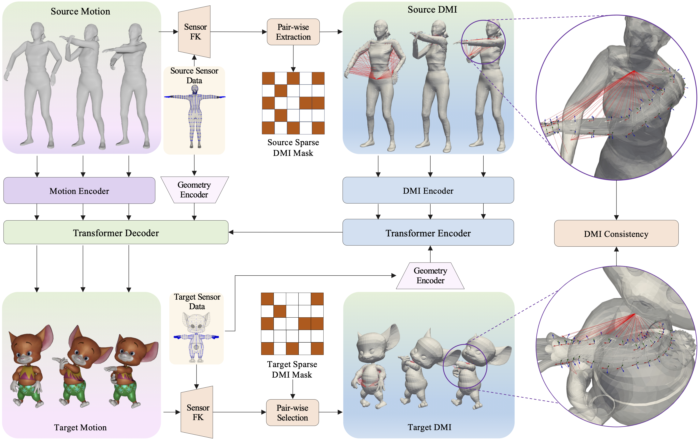

# MeshRet
Official implementation for the NeurIPS 2024 spotlight paper **"Skinned Motion Retargeting with Dense Geometric Interaction Perception"**.

[Project Page](https://abcyzj.github.io/MeshRet/)



## Bibtex

```bibtex
@article{ye2024skinned,
  title={Skinned Motion Retargeting with Dense Geometric Interaction Perception},
  author={Ye, Zijie and Liu, Jia-Wei and Jia, Jia and Sun, Shikun and Shou, Mike Zheng},
  journal={Advances in Neural Information Processing Systems},
  year={2024}
}
```

Code and dataset coming soon.
